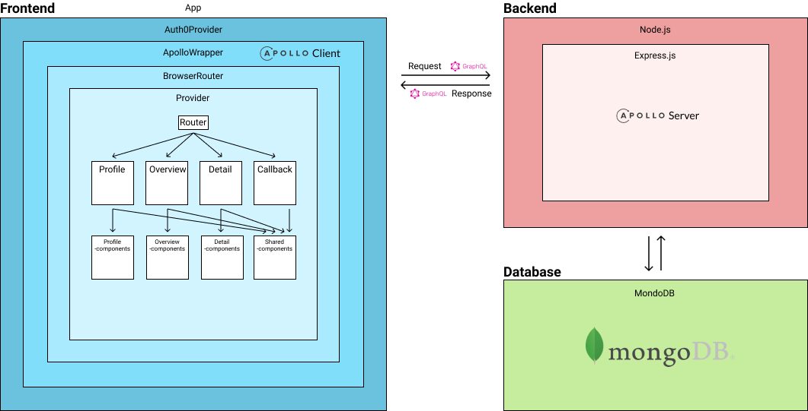

# WineEncyclopedia

_...gif is loading_


WineEncyclopedia is used for finding different kinds of beverages. The dataset is gathered from Vinmonopolets exposed, free CSV-file.
This can be done by searching on product names, including filtering on category, volume and price.
Each product can be clicked on and the site will then render a product page showing more details about the chosen product.
<br>
<br>
On the product site you can review products and see the reviews written by others.
However to be able to review you have to log in. You can log in from the product site or by clicking the profile icon in the upper right corner.
When you are logged in you can visit your profile page by clicking the profile icon.
This will show information about your profile and reviews.

## Run project

```
$ git clone git@gitlab.stud.idi.ntnu.no:it2810-h20/team-49/prosjekt3.git
$ npm install
$ npm run dev
```

## Run tests

```
# Open a new terminal and make sure frontend and backend is running
$ cd frontend

# Run unit tests:
$ npm test

# Run end to end tests:
$ npm run cy:run

# If you want to see the end to end test running:
$ npm run cy:open
(Wait for new window to open)
Click on e2e.ts
```

## Log in

The web app uses Auth0 to authorize users (Read more under [authentication](#authentication))<br>
You can log in by creating a user with either Google-sign-in or with a proprietary username and password. <br>
If you don't want to create a user, you can log in with our test user:<br>
**Username**: testUser123@gmail.com<br>
**Password**: ValidPassword123

## Structure



**/root**: The root of the project. It contains the frontend and backend as separate parts including a _package.json_ to simplify the installation/usage of the webapp <br>

- **/backend**
  - **/src**: Contains the backend logic. _index.ts_ starts the server and connects to the database. _resolver.ts_ and _typeDefs.ts_ contains Apollo GraphQL-specific logic for defining the available types and queries/mutations<br>
    - **/models**: Contains the different schemas contained in the database. These models are modelled using _Mongoose_ <br>
    - **/utils**: Utility-functions for the backend. It only contains a script for verifying JWT. Read more about this under #Authentication. <br>
- **/frontend**
  - **/\_\_generated\_\_**: Contains type-definitions generated by apollo codegen<br>
  - **/cypress**: Cypress testing files. (Read more under #Testing)<br>
    - **/integration**: Contains our test file for e2e testing
  - **/public**: Contains assets and other static files hosted with the client<br>
  - **/src**: The source-code of the project frontend part<br>
    - **/\_\_tests\_\_**: Contains the unit- and snapshot-tests and the reference snapshots <br>
    - **/components**: Includes every component used by the application. The folder is divided into subfolders where every subfolder includes components (.tsx-files) related to that specific area of concern <br>
      - **/graphql**: Contains every GraphQL query/mutation, and their related, generated type-definitions in \_\_generated\_\_. <br>
      - **/pages**: Contains the different pages/routes <br>
      - **/store**: Redux specific files
        - **/action**: Contains every action defined for redux <br>
        - **/reducer**: Contains the reducer used to update and mutate state <br>
        - **/types**: Contains redux-specific type-definitions <br>
      - **/types**: Contains global TS-interfaces <br>
      - **/utils**: Utility-functions for the frontend. It only contains a wrapper-script for tapping into the headers apollo and integrate it with Auth0 (Read more under #Authentication and #Apollo) <br>

**Mentionable files:**

- **.env**: Environment variables used throughout the project. These would normally not be pushed to version control, but given the nature of peer-grading, it’s necessary that we reveal these
- **cypress.json**: Cypress-specific environment variables
- **apollo.config.js**: Defines the connection to the remote _Apollo studio_.

# Tech Stack

We are using a MERN stack with GraphQL. More specifically we are using MongoDB,
Express, React with Typescript and Node.js. In addition we are using Apollo,
Mongoose and Auth0.

## Frontend

### React & Typescript

The project is written with React and Typescript. The project aims to follow well known good practices and keep the code modular. TypeScript is used in preference of JavaScript
as this enables the team to reference the same types, and avoid pain inducing run-time errors.

### Material-UI

As we were encouraged to use libraries for frontend, we chose to use Material-UI. Material-UI is a UI-library that
contains a large set of customizable components, icons and themes.

### Redux (State Management)

We use Redux for frontend-specific state management. The global state helps us share state to components that have a larger area of concern than its local state. The AppState contains:

- “modalOpen”: used for keeping track of the product-review modal
- “searchtext”: used to update the search. When the text is “” (empty) it will search for all items
- “filterOptions”: used for filtering the data
- “viewMode”: used to check if the data to be loaded should be appended or if the webapp should query a new set

## Backend

### MongoDB

For our database we use MongoDB. MongoDB is a NoSQL database which makes it easy to store different documents and add/update independent fields. MongoDB is also very easy to query. The queries are implemented in the backend resolver.

We connect to MongoDB through Mongoose which is a library that makes it easier to model the different object-schemas. This connection is executed in `backend/index.ts`

#### Apollo Client & GraphQL

To retrieve data from the backend to the client we use Apollo Client. Apollo Client is a comprehensive state management library for JavaScript/TypeScript that enables us to manage both local and remote data with GraphQL. Apollo also makes it easy to generate the TypeScript-interfaces of every query and mutation with `apollo codegen`.

GraphQL enables the client to ask the backend for specific fields of data. This is convenient as it enables us to fetch exactly the data we need, instead of continuously over-/underfetch. An example of this is shown in the query `productsQuery`.
Instead of fetching all fields from the product we exclude fields like _Farge_, _Lukt_, _Smak_ as we’re not interested in those fields where we query these products.

**Lazyloading:**
Lazy loading is implemented to make sure the client fetch feasible amounts of data - GraphQL and Apollo Client makes this easy.
The implementation of lazy loading (fetching additional data and adding it to the current dataset) is implemented in _/frontend/src/components/Overview/ProductListView_ using `fetchMore`. The `fetchmore` function runs each time you scroll to the bottom of the current dataset and will fetch 30 (or less/none based on the current search/filter settings) products.
This is done by passing in a new filterIndex, a variable the same as the length of the current list of data. To make this work we made our function for fetching data skip the provided index (in the database ignoring the items before the index), so we are actually using the same function for fetching data each time just with different variables.
This function is called `products` and is defined under: `/backend/src/resolvers`.

#### Authentication

For authentication the webapp implements Auth0. Auth0 is an out-of-the-box authentication & authorization platform. Auth0 keeps a username-password-database so that we don’t have to worry about implementing encryption for passwords and risk leaking sensitive information.

_An example of the usecase for Auth0:_
As we don’t want users who aren't logged in to add reviews for a product, Auth0 let’s us secure the addReview-mutation.
By wrapping this mutation in `withAuth` a user without a valid, verified JSON Web Token (JWT) will not be able to execute this call. I.e. if a user somehow bypasses the client-side logic and pretends that they have a user - they still wouldn’t be able to add a review because the authentication prevents it in the backend.

## Testing

### Unit Testing

For unit testing we chose to use the react testing library. With this library it encourages us to test the components in the way a user will interact with it.
React testing library also enforces us to write better components, with regards to web accessibility.
Furthermore, it requires no setup and is already installed with create-react-app.

In our unit tests we test:

- That the _Logo component_ renders correctly, handles interactions as intended and that it matches the snapshot
- That the _Search component_ is working as intended
- That the reducer returns the correct state after an redux action
- That the _Detail component_ render the correct data by mocking graphql queries using a \<MockedProvider>
- That the UI doesn't change unexpected with a snapshot of the whole app

### End-2-End Testing

For end to end testing we are using cypress. Cypress is a front end testing tool built for the modern web. The test can be found under `/frontend/cypress/integration/e2e.ts`. Cypress tests are fast and easy to write with just a few lines of code needed.
Currently we are testing the different functionality of the application. This includes filtering, searching, looking at products and signing in to comment products.

As described at the beginning the test can be run either with `cy:run` or `cy:open`. `cy:run` will run the tests to see if everything is working, but not showing what is done. With `cy:open` you get to see what is happening and it helps to see what the tests are doing.

## Styling

For styling we have used Material-UI’s hook API. This provides the developers with the ability to extend how styling is usually done. Every styled component is styled locally with the `useStyles`-hook, implemented in Typescript.
We have been consistent with the use of styling by only implementing styles from this API, with the exception of `App.css` for setting colors and font.
This consistency makes our code easier to read and more structured in contrast to using different styling implementations. Most of the components in Material-UI is already responsive, but we've extended this by using breakpoints with the hook API’s theme. This is similar to CSS media queries.

## Use of git

During our development we have described tasks usings issues in GitLab.
Every commit was to be on the form “#issuenumber description”, where the issue number corresponds to the issue on GitLab and the description describing what was contributed.
We developed using branches corresponding to one or more issues. The branches were then merged to master via merge requests, the merge requests were to be accepted by someone else on the team.
